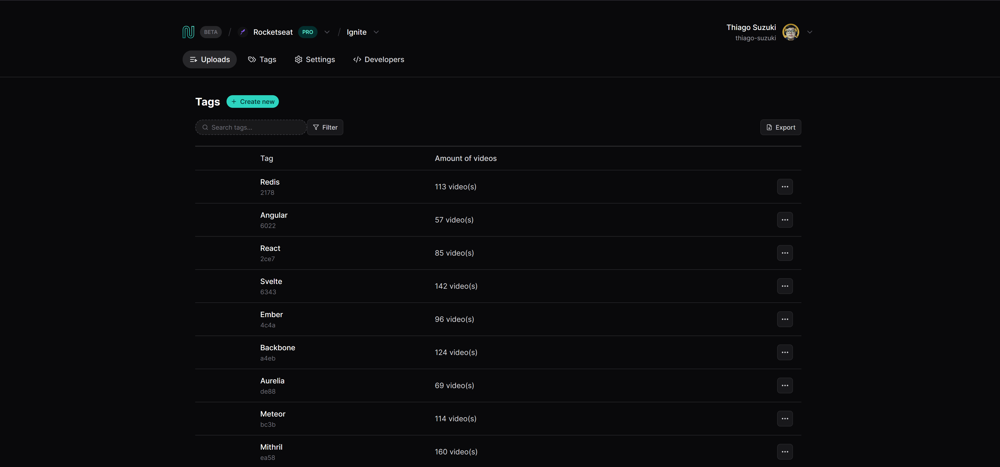

# React na Prática 01
Aplicação de Listagem de Dados desenvolvida durante o Evento Gratuito da Rocketseat

<h1 align="center">
  
</h1>

## 💻 Tecnologias Utilizadas nesse Projeto
<div style="display: inline_block">
  
  
  
</div>

<br>

## Especificações
- Node: 20.10.0
- Pacote de Gerenciamento de Dependências: PNPM
- Framework: React + Vite

<br>

## Como instalar as dependências
```bash
$ pnpm install
```

## Rodar o Frontend e Server (Abrir em dois terminais)
```bash
$ pnpm run dev
$ pnpm run server
```

